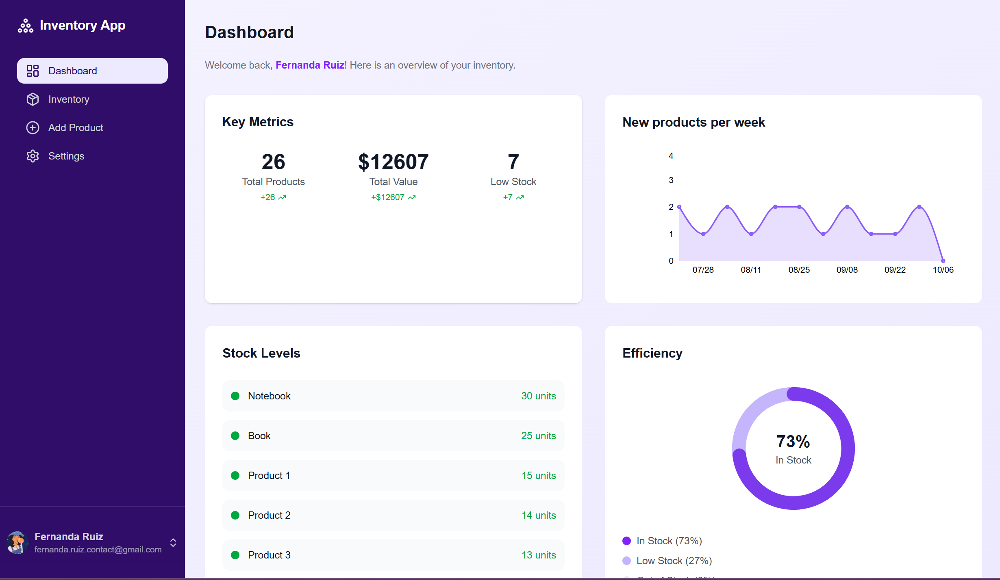
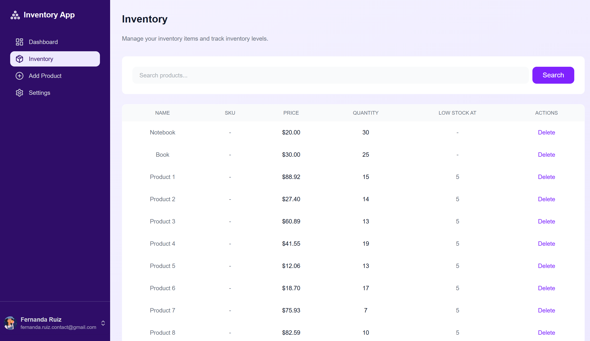
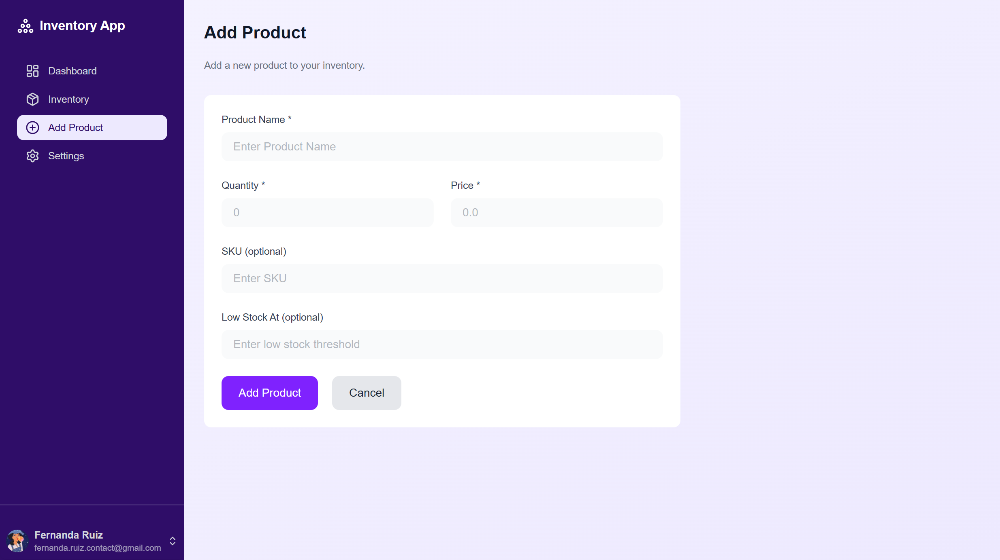

<!-- PROJECT_METADATA
{
  "title": "Inventory Management System",
  "description": "A full-stack inventory management app with a real-time dashboard, product CRUD, search and pagination, and secure authentication. Built with Next.js, TypeScript, PostgreSQL, and Prisma.",
  "imagePreview": "https://github.com/user-attachments/assets/85cecf34-dd52-4082-9063-3f2fd47ed641",
  "githubLink": "https://github.com/FerRuizDevp/inventory-management-website",
  "liveLink": "https://inventory-management-website-five.vercel.app",
  "tags": ["all-projects", "React", "Typescript", "Nextjs", "PostgreSQL", "Tailwind"]
}
-->

# 📦 Inventory Management System

A full-stack inventory management app built with Next.js, letting users track products, monitor stock levels, and manage inventory through a real-time dashboard.

🔗 **Live demo:** [inventory-management-website-five.vercel.app](https://inventory-management-website-five.vercel.app)

## Screenshots

### Dashboard


### Inventory


### Add Product


## Features

- **Dashboard** — key metrics (total products, inventory value, low-stock count), a weekly new-products chart, and a stock-level breakdown ring, all built with Recharts and SVG
- **Inventory management** — full CRUD: add products, search by name, paginate large lists, and delete with a confirmation modal
- **Authentication** — secure sign-up/sign-in via email/password or GitHub OAuth, powered by Neon's managed Better Auth
- **Account settings** — editable user profile

## Tech Stack

- **Framework:** Next.js 16 (App Router, Server Components, Server Actions)
- **Database:** PostgreSQL on Neon
- **ORM:** Prisma 8
- **Auth:** Neon Managed Better Auth
- **Styling:** Tailwind CSS
- **Charts:** Recharts
- **Validation:** Zod
- **Deployment:** Vercel

## Getting Started

```bash
git clone https://github.com/FerRuizDevp/inventory-management-website.git
cd inventory-management-website
npm install
```

Create a `.env` file with:

```
DATABASE_URL=
NEON_AUTH_BASE_URL=
NEON_AUTH_COOKIE_SECRET=
```

```bash
npm run dev
```

## Author

**Fernanda Ruiz** ([@FerRuizDevp](https://github.com/FerRuizDevp))
